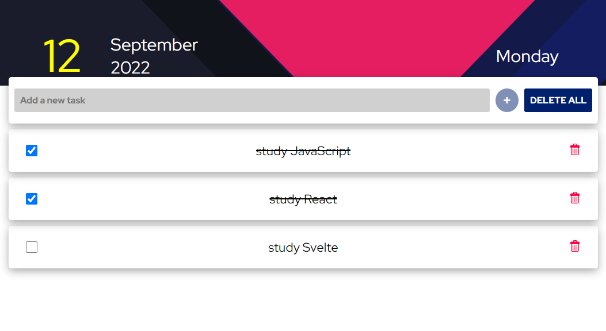

# To-Do List App

Project created with html, css and javascript. In this project the user can create and save a list of tasks, to save the tasks the localStorage of the browser is used and thanks to this the tasks are not lost when reloading or opening this website in another browser window. The list of created tasks will not be displayed if the user opens this website in another web browser. [Click here to see the project](https://tdo-list.netlify.app/ "click here to see the project")

## Features

---

